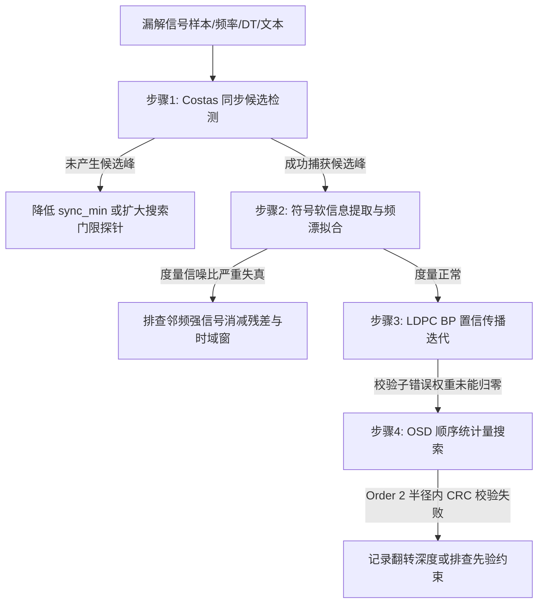

# Rust-FT8 基准测试与对比代码运行操作指南 (交接文档)

> **文档目的**：本文档旨在为后续开发会话及协同开发者提供标准化、100% 可复现的基准测试、微基准性能评测及真值对比操作手册。
> **核心原则**：严谨实事求是、拒绝经验主义与无依据推论，所有性能、召回率、SNR/DT 偏差及漏解成因均基于确凿的代码探针与实测数据驱动。

> **2026-10-03 修复后复测**：22 组 WAV、3 Pass 深搜的参考文本 362 条，Rust 输出 345 条，匹配 322 条，未匹配 40 条，基准外 23 条（召回率 88.95%）。具体漏检阶段、修复与速度测量见 [解码漏检与速度审计](DECODE_AND_SPEED_AUDIT_2026-10-03.md)。下文以实时测试输出为准。

---

## 一、测试机硬件与软件环境

本仓库所有基准数据均在以下基准环境下实测得出：

- **硬件设备**：PC 工作站 (Intel Core i5-8265U CPU @ 1.60GHz, 4核8线程, 16.0 GB RAM)
- **操作系统**：Windows 11 专业工作站版 (24H2, 64-bit)
- **Rust 工具链**：`stable-x86_64-pc-windows-msvc` (Rust 1.75+)
- **编译配置**：`Cargo.toml` 中 `profile.release` 配置：
  ```toml
  [profile.release]
  opt-level = 3
  lto = "thin"
  codegen-units = 16
  panic = "abort"
  ```

---

## 二、测试数据集与基准真值 (Ground Truth) 说明

### 1. 数据集目录结构

所有测试音频与标准真值文件均存放于本仓库的 `tests/wav/` 目录下（同时镜像存放在 `reference/ft8_lib/test/wav/`，测试代码会自动探测并解析两处路径）：

```text
tests/wav/
├── websdr_test1.wav  ~ websdr_test13.wav   # 13 个公开 WebSDR 真实密集通联环境录音 (12000Hz PCM)
├── websdr_test1.txt  ~ websdr_test13.txt   # 对应 13 个样本的标准基准真值文本
├── 191111_110115.wav ~ 191111_110700.wav   # 9 个 ft8_lib 官方标准 Baseline 样本录音
└── 191111_110115.txt ~ 191111_110700.txt   # 对应 9 个 Baseline 样本的标准基准真值文本
```

### 2. 基准真值 (Ground Truth) 格式规范

同名的 `.txt` 文本由标准 `wsjtx-lib`（C++/Fortran 官方内核）或 `ft8_lib` 生成，每行代表一条标准解调信号，字段格式如下：

```text
<SNR(dB)>  <DT(s)>  <Freq(Hz)>  ~  <Message>
```

**示例** (`tests/wav/websdr_test1.txt`)：
```text
 -14  -0.56   309 ~ G4CUS SP4FCA +10
 -15   1.05   528 ~ VK3EVE SQ3MZM -24
  +6   2.22   587 ~ LZ1LZ G4UJS IO83
 -10   0.56   691 ~ YO6OGJ F4IAG R-09
 +16   1.13  1109 ~ CQ IK4LZH JN54
```

---

## 三、基准测试与对比测试命令全集 (复制即用)

以下命令均在项目根目录 `d:\SyncThing\Rust-FT8` 下直接运行：

### 1. 全量 22 组 WAV 详尽诊断与精度对比测试 (最核心命令)

该测试自动遍历 22 个音频样本与 Ground Truth 文本，执行当前纯 Rust 3-Pass 深度解调流水线，逐条进行文本和频点对齐，统计召回率、精确率、SNR 偏差（MAE 与代数均值）、DT 延迟偏差以及明细清单。

```bash
cargo test --release --test full_diag_report -- --nocapture
```

- **测试源码位置**：`tests/full_diag_report.rs`
- **主要输出内容**：
  1. 22 个文件各自的：基准数、实际解出数、匹配数、漏解数、多解数、耗时；
  2. 全局统计总览：样本总数、总消息数、成功匹配数、召回率（Recall）、精确率（Precision）；
  3. SNR 差异统计：Mean(ΔSNR)、MAE(ΔSNR)、$|\Delta\text{SNR}| \le 1\text{dB}, 2\text{dB}, 3\text{dB}$ 分布比例；
  4. 时间延迟 DT 差异统计：Mean(ΔDT)、MAE(ΔDT)、$|\Delta\text{DT}| \le 50\text{ms}, 100\text{ms}$ 分布比例；
  5. 频率偏差 MAE(ΔFreq)；
  6. 未解码出来（漏解 / Missed）信号明细表（含样本名、频率、SNR、DT、原文本）；
  7. 额外解调出来（多解 / Extra）信号明细表。

---

### 2. 算法内核微基准耗时评测 (Micro-benchmark)

用于评测底层核心算子的纯微秒级/纳秒级计算耗时，验证 SIMD、查表法及拓扑前缀积的性能：

```bash
cargo test --release --test profile_bench -- --nocapture
```

- **测试源码位置**：`tests/profile_bench.rs`
- **当前测试涵盖项**：Order 2 OSD、30 轮 BP，以及 `websdr_test5.wav` 的标准模式与深搜模式整段耗时。当前 `profile_bench.rs` 没有单独的 CRC 或单条信号消减微基准。

---

### 3. 单音频消减耗时与条数基准 (以 `websdr_test1.wav` 为例)

用于精细拆解单音频各 Pass 的耗时组成（候选搜索、FFT、并行译码、时域消减）与检出条数：

```bash
cargo test --release --test benchmark_tests test_decode_single_wav_websdr_test1 -- --nocapture
```

- **测试源码位置**：`tests/benchmark_tests.rs`
- **对应深度搜索模式测试**：
  ```bash
  cargo test --release --test benchmark_tests test_decode_single_wav_websdr_test1_deep_search -- --nocapture
  ```

---

### 4. 流式边收边解与提前解码实测回放

模拟声卡每次推入 1 个符号（160ms，1920 个采样点），测试流式事件通知流与提前出结果：

```bash
cargo test --release --test streaming_tests test_streaming_early_decoding_websdr_test1 -- --nocapture
```

- **测试源码位置**：`tests/streaming_tests.rs`
- **验证的关键事件**：
  - $t = 1.44\text{s}$：前导码捕获事件；
  - $t = 11.36\text{s}$（提前 3.64s）：输出首批强信号事件；
  - $t = 12.48\text{s}$（提前 2.52s）：全时隙扫尾完成事件。

---

### 5. 用户功能与格式假解码过滤回归测试

验证 uint64 序列号透传、同步与异步回调双模式、以及仿 WSJT-X 假解码过滤机制：

```bash
cargo test --test user_features_tests -- --nocapture
```

- **测试源码位置**：`tests/user_features_tests.rs`

---

## 四、对齐逻辑与判决指标算法 (Ground Truth 对比准则)

在 `tests/full_diag_report.rs` 中，比对逻辑遵循严谨的判决标准：

### 1. 消息文本归一化 (`normalize_msg`)
对于非标准非哈希呼号（包含 `<...>` 形式），自动将 `<` 与 `>` 包裹的任意呼号统一映射为 `<...>`，以消除不同版本哈希查表显示差异对文本匹配的干扰。

### 2. 判定为“成功匹配 (Matched)”的充要条件
对于实际解出的一条信号 $D$ 与参考基准的一条信号 $G$：
1. **文本匹配**：归一化后的消息完全相同，或者互为包含子集；
2. **频偏门限**：两者的中心频率差值满足 $|\text{Freq}_D - \text{Freq}_G| \le 15.0\text{ Hz}$（即 2.4 个音调带宽以内）。

### 3. 指标计算公式
- **召回率 (Recall)**：$\text{Recall} = \frac{N_{\text{matched}}}{N_{\text{ground\_truth}}} \times 100\%$
- **精确率 (Precision)**：$\text{Precision} = \frac{N_{\text{matched}}}{N_{\text{actual\_decoded}}} \times 100\%$
- **SNR 代数均值与平均绝对误差 (MAE)**：
  $$\text{Mean}(\Delta\text{SNR}) = \frac{1}{N}\sum (\text{SNR}_{\text{dec}} - \text{SNR}_{\text{ref}})$$
  $$\text{MAE}(\Delta\text{SNR}) = \frac{1}{N}\sum |\text{SNR}_{\text{dec}} - \text{SNR}_{\text{ref}}|$$
- **DT 时间延迟误差 (MAE)**：
  $$\text{MAE}(\Delta\text{DT}) = \frac{1}{N}\sum |\text{DT}_{\text{dec}} - \text{DT}_{\text{ref}}|$$

---

## 五、科学排查漏解信号的实证方法 (杜绝主观臆测)

对于当前测试报告中的漏检记录，**严禁仅凭信噪比数字或经验进行推断归类**。必须采用单信号隔离探针法，从信号物理层流转链路逐步定位其是在哪一步被丢弃的：



### 实施单信号隔离排查的具体步骤：

1. **提取漏解目标**：运行 `full_diag_report`，记录某条特定漏解信号的目标频率 $f_0$、时间 $t_0$ 与参考内容。
2. **在 `sync.rs` 插入候选探测断点/日志**：
   在 `find_candidates` 中加入判断：
   ```rust
   if (freq - target_f0).abs() < 10.0 {
       println!("[Probe Sync] 候选频率={:.1}, 得分={:.3}, 门限={:.3}", freq, score, sync_min);
   }
   ```
   - 若得分低于门限：说明目标候选没有通过当前粗同步门限；继续检查邻近峰、排名和后续残差，不要仅凭 SNR 归因。
   - 若产生候选但后续未解出：说明同步成功，问题在后续环节。
3. **在 `pipeline.rs` 插入译码探测断点**：
   在并行译码段追踪目标候选信号：
   - 检查 `bp_decode` 返回的迭代轮数、失败时保存的后验 LLR；
   - 检查 `osd_decode` 是否找到通过 CRC 的候选及其硬错误数、软距离；
   - 检查通过 CRC 校验后的消息是否被 `extract.rs` 的硬错误数、i3/n3 格式或 OSD 消息类型规则剔除，也要检查 `pipeline.rs` 的全局文本去重。不同文本的时频近邻互斥已在 2026-10-03 修复。

---

## 六、交接与后续开发任务清单

下一个会话接手本项目时，建议按以下清晰路径推进：

1. **第 1 项任务**：运行 `cargo test --release --test full_diag_report -- --nocapture`，获取完整的漏解明细清单；
2. **第 2 项任务**：选取 2~3 个典型的漏解信号（例如 `websdr_test1.wav` 中未能解出的 3 条信号），使用上述探针法定位其实际失败环节；
3. **第 3 项任务**：根据实证结果，开展针对性算法改进（如局部残差补扫或频偏边界放宽）；
4. **第 4 项任务**：在非先验算法达到上限后，按计划最后开展 AP（A Priori）先验信息译码系统开发。
