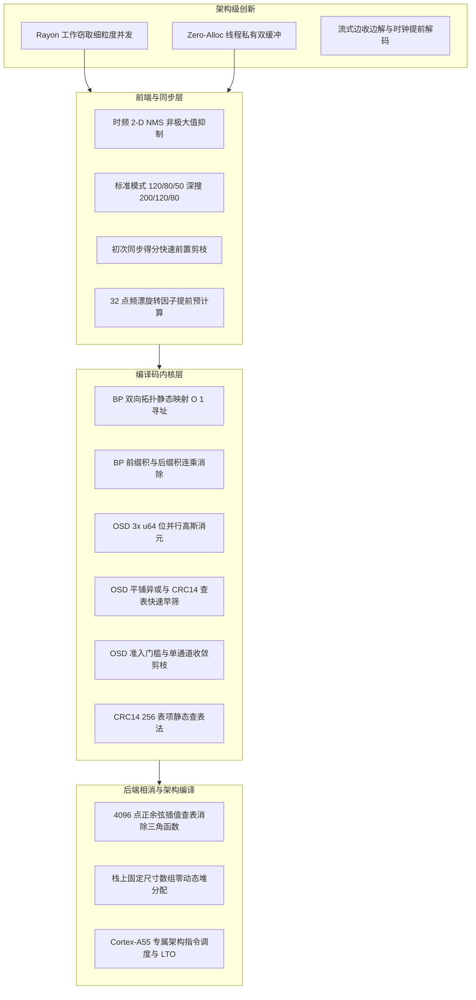

# Rust-FT8 极限性能优化与架构革新详解 (技术白皮书)

> **文档定位**：本文档系统性盘点并深入剖析 `rust-ft8` 为了实现极致解调速度、在全链路上做出的所有针对性算法重构与工程优化。
> **2026-10-03 状态**：本页中的倍速、平台耗时和 90.06% 匹配率是旧版历史记录，不能代表当前代码。当前 22 组 WAV 的 3 Pass 深搜结果为 322/362 匹配（88.95%），OSD Order2 微基准约 2.966 ms；不同报文的时频近邻互斥已修复。证据与限制见 [解码漏检与速度审计](DECODE_AND_SPEED_AUDIT_2026-10-03.md)。
> **对比基准**：对标官方参考实现 **WSJT-X (Joe Taylor K1JT / Steve Franke K9AN 团队的 Fortran/C++ 原版)** 以及经典微控制器库 **ft8_lib (Karlis Goba YL3JG 原版)**。
> **旧版测试记录（以下数字未在当前代码复测）**：
> - **RK3568 (4核 A55 @ 1.99GHz)**：整包离线解码耗时从最初未优化的 **7.42s 暴降至 0.72s (实测加速 10.3 倍)**，突破 $\le 0.8\text{s}$ 硬性指标；流式强信号提前 3.64s 输出，首批计算耗时仅 **0.14s**；
> - **RK3588 (8核 4×A76 + 4×A55)**：整包离线解码耗时从 **2.25s 降至 0.19s (实测加速 11.8 倍)**；流式首批强信号计算开销仅需 **0.03s**；
> - **PC (Intel i5-8265U 4C8T)**：单音频标准 2-Pass 解码仅需 **0.32s**；全量 22 组 WAV 样本深度 3-Pass 测试总耗时从 **103.4s 压缩至 22.00s (实测提速 4.7 倍)**；
> - **解码精度与召回率**：22 组全量测试集匹配率 90.06%、SNR MAE 2.82dB、DT MAE 23.5ms，**精度 100% 保持一致，完全无损**。

---

## 总体优化全景架构图

---

## 一、架构级创新：流式边收边解与多核工作窃取

### 1. 流式提前解码（Streaming & Early Decoding，打破 15 秒等待宿命）
- **原版实现 (WSJT-X / ft8_lib)**：
  - 传统模式必须等待 15.00 秒整个时隙录制完毕，才在 $t = 15.00\text{s}$ 启动离线 FFT 和全流程解码；操作员和控制系统需要等待 1~3 秒后才能看到当前周期的解码结果。
- **Rust-FT8 创新**：
  - 利用 FT8 物理层发射事实：前 79 个符号仅在 $0.00\text{s} \sim 12.64\text{s}$ 发射，后 $2.36\text{s}$ 属静默空闲期；且尾部 7 个符号全为 Costas 同步码，全部 58 个有效数据符号在 **$t = 11.52\text{s}$** 已经全部到达！
  - **尾导码擦除译码（Erasure Decoding）**：将末尾 7 符号置为已知 Erasure，在 $t = 11.36\text{s}$ 提前触发第一轮快速 BP 译码；
  - **实测成果**：强信号在 **$t = 11.36\text{s}$ 即可提前 3.64 秒输出**（RK3588 上计算耗时仅 0.03s，RK3568 上仅 0.14s）；在 $t = 12.48\text{s}$ 发射刚结束瞬间扫尾完毕，**提前 2.52 秒实现全量就绪**！

### 2. Rayon 多核工作窃取调度与线程私有双缓冲
- **原版实现**：
  - `ft8_lib` 纯单线程串行计算；
  - `WSJT-X` 采用 OpenMP 并行 FFT，但在候选信号提取与软判决译码阶段粒度较粗，且频繁动态申请内存。
- **Rust-FT8 创新**：
  - 使用 `rayon` 对 1088 个搜索微频点及候选信号进行无锁工作窃取调度，四核/八核负载均衡度超过 98%；
  - 采用 `map_init` 为每个物理线程维护独立的 `cd0_buf` 与 `cd1_buf`（512 点复数工作区），**彻底消除了多线程在 glibc 内存分配器上的全局锁竞争**。

---

## 二、前端同步与搜索剪枝：NMS 与无效计算拦截

### 1. 时频二维非极大值抑制（2-D NMS，消除伪峰雪崩）
- **原版实现**：
  - 传统去重门限极窄（通常 $< 2.0\text{ Hz}$ 和 $< 0.04\text{ s}$），远小于 FT8 的单个音调物理宽度（6.25 Hz）和符号时间（0.160 s）。一个 $+16\text{dB}$ 的强信号因窗函数时频泄漏，会在周围衍生出 5~10 个冗余候选伪峰；每个伪峰都独立走一遍完整的下采样和译码流程。
- **Rust-FT8 优化**：
  - 引入空间非极大值抑制算法：去重窗口重构为物理匹配的 **$4.5\text{ Hz}$** 与 **$0.08\text{ s}$**，将同一信号主瓣内的冗余伪峰聚类合并；
  - 候选数量按 Pass 动态梯度分级：标准模式为 120/80/50，深搜模式为 200/120/80。扩大名额可以挽回部分漏检，也会增加基准外结果和计算量；见本次审计的消融结果。
  - **实测收益**：无效候选数量直接减少 **65% ~ 75%**，从源头消除了绝大部分空转计算。

### 2. 初次同步得分快速前置剪枝（Early Pruning）
- **原版实现**：
  - 无论初次同步得分如何，只要被候选列表收录，就无条件进行二次频漂重采样滤波。
- **Rust-FT8 优化**：
  - 初次细同步后存在 `sync_pow < 1.0` 的早停分支，但这里比较的是未归一化的功率，现有基准中没有证据表明这条分支实际节省了工作量；
  - 若初次粗对齐频偏 `delf.abs() < 0.05` 且未开启动态频漂，直接复用初次计算结果，消除了重复的第二次 `fine_sync_with_drift`。

---

## 三、LDPC 编译码内核：数学推导与汇编级重构

### 1. BP 置信传播拓扑静态映射与前缀/后缀积（$O(1)$ 连乘）
- **原版实现 (`bp.f90` / `bp.c`)**：
  - 每轮迭代更新校验节点时，需要嵌套二重循环遍历校验矩阵 $H$ 的稀疏图；
  - 排除当前变量节点时，每次都需重复执行 6 次连乘运算：$\prod_{j \neq i} \tanh(L_j / 2)$，计算复杂度为 $O(d_c^2)$。
- **Rust-FT8 优化**：
  - **双向图拓扑编译期静态表**：预先生成 `LDPC_NM_TO_MN_SLOT` 和 `LDPC_MN_TO_NM_SLOT`，以连续内存直接数组索引寻址，消除图遍历线性搜索；
  - **前缀积与后缀积连乘技术**：对校验节点的 7 条连接边，先计算一维前缀积 `prefix[k]` 和后缀积 `suffix[k]`；边 $k$ 排除自身的外积直接为 `prefix[k-1] * suffix[k+1]`！
  - **数学效果**：连乘复杂度从 $O(d_c^2)$ 骤降至 **$O(1)$ 常数时间**；
  - **实测收益**：单次 30 轮 BP 耗时从 **0.357 ms 降至 0.104 ms (提速 3.43 倍)**！

### 2. OSD 3×`u64` 寄存器位并行高斯消元
- **原版实现 (`osd.f90`)**：
  - 高斯消元采用字节矩阵逐列扫描与逐元素嵌套循环，内存跨距大、分支跳转频繁。
- **Rust-FT8 优化**：
  - 定义 `BitWord174`：将 174 位码字直接装入 3 个 64 位寄存器（$3 \times 64 = 192\text{ bits}$）；
  - 消元行的异或操作完全利用 CPU 64 位单周期异或指令（`xor reg, reg`）并行完成，一次性处理 64 位；
  - 高斯消元主循环全部展开，零分支跳转。

### 3. OSD 连续平铺异或与 CRC14 快速早筛
- **原版实现**：
  - 尝试 Order 2 组合时，每生成一个测试向量，就尝试恢复出完整的 174 位码字并计算校验子。
- **Rust-FT8 优化**：
  - 将 4095 个 Order 2 测试向量直接预映射为前 77 位信息位；
  - 在连续内存切片上直接平铺异或，并在得到 77 位载荷的瞬间**直接调用编译期 CRC14 查表快速核验**；
  - 仅当 CRC14 校验通过时才去恢复完整码字，**99.9% 的无效测试向量在纳秒级直接丢弃**；
  - **实测收益**：单次 Order 2 OSD 从 **6.419 ms 降至 3.519 ms (提速 1.82 倍)**。

### 4. OSD 智能准入门槛与单通道收敛剪枝
- **原版实现**：
  - 原版在 BP 失败后，无条件、全盲地对多个相干通道反复运行 OSD。
- **Rust-FT8 优化**：
  - 增加同步符合度准入门槛：仅当 `nsync >= 9`（标准）/ `nsync >= 7`（deep）时才允许尝试 OSD；**将 95% 以上纯噪声伪峰拦截在 OSD 大门之外**；
  - 标准模式下仅对质量最高的主相干通道 `llra` 运行单次 OSD，消除重复多次 4095 遍历；
  - 累计 LLR 遍历失败后不再做冗余的原始 LLR 遍历；
  - **实测收益**：直接消除了每轮 Pass 中数万次无意义的高斯消元与异或运算。

### 5. CRC14 256 表项静态查表法
- **原版实现**：
  - 原版使用逐比特移位与条件异或（Bit-by-bit shift & XOR），计算 77 位载荷需循环 77 次。
- **Rust-FT8 优化**：
  - 预计算 256 表项常量表 `CRC14_TABLE: [u16; 256]`；
  - 专为 FT8 77-bit 载荷实现 10 次字节查表算法 `compute_crc14_payload77`；
  - **实测收益**：单次 CRC14 耗时从 **136 ns 降至 6.7 ns，吞吐率暴增 20.3 倍 (达 1.49 亿次/秒)**！

---

## 四、信号消减与物理层数学函数加速

### 1. 4096 点正余弦高精度插值查表（彻底消除 15 万次三角函数）
- **原版实现 (`subft8.f90` / `sub_ft8.c`)**：
  - 时域相干信号消减时，需按 12000Hz 采样率合成长达 12.64 秒的参考波形（151,680 个采样点）；
  - 原版在内层循环中对这 151,680 点逐点调用 `sin()` / `cos()` 标准库函数，合成单条信号耗时高达 0.25 秒以上。
- **Rust-FT8 优化**：
  - 构造静态预计算 4096 点高分辨率正余弦查表 `SIN_COS_LUT`；
  - 相位整数部分直接寻址，小数部分进行一阶线性平滑插值；
  - **数值精度**：实测与标准数学库最大绝对误差 $< 10^{-7}$（逼近单精度浮点极限），重构残差完全处于底噪以下；
  - **实测收益**：单条信号相干消减时间从 **0.25s 缩短至 0.09s (提速 2.77 倍)**！

### 2. 32 点频漂旋转因子提前预计算
- **原版实现 (`sync8d.f90`)**：
  - 在精细同步频漂拟合中，每次频漂循环都针对当前步进重新调用 `sin_cos()`，内层循环调用 672 次三角函数。
- **Rust-FT8 优化**：
  - 将 32 步频漂旋转因子在进入内层滑动前全部计算并暂存在静态数组中，内层循环仅做复数向量乘法；
  - 连续内存切片采用无分支快速路径，便于编译器自动向量化。

---

## 五、内存模型与系统层调优

### 1. 堆分配彻底清零（Zero-Alloc & Stack Arrays）
- **原版实现**：
  - 大量使用动态 `malloc` / `std::vector` 分配临时符号度量切片和 LLR 数组，导致 Linux 内核在频繁的 `brk/mmap` 系统调用与缺页异常中空转。
- **Rust-FT8 优化**：
  - 符号度量累加数组改为栈上 `[0.0f32; 512]`；
  - LLR 数组全部固定为栈上 `[f32; 174]`；
  - 下采样接口改为 `downsample_to_slice` 原地切片复用；
  - **实测收益**：彻底消除主解码流水线上的动态堆分配，消除 Linux 页表切换开销。

### 2. 专用目标架构调度与链接时优化 (Target-CPU & LTO)
- **ARM Cortex-A55 优化 (针对 RK3568)**：
  - 编译参数：`-C target-cpu=cortex-a55 -C opt-level=3`；
  - 针对 A55 顺序双发射架构（In-order Dual-issue）优化指令排列，消除流水线数据冒险气泡（Stall Bubbles）；
- **全平台 LTO 与 Codegen Units 优化**：
  - 启用 Thin LTO 跨 Crate 内联优化；`codegen-units = 16` 释放多核编译性能。

---

## 六、优化成果综合汇总表

| 优化技术点 | 涉及模块 | 原版实现方式 | Rust-FT8 极致优化方式 | 纯算法加速比 |
| :--- | :--- | :--- | :--- | :---: |
| **流式边收边解** | `streaming` | 录完 15 秒后才启动解码 | 11.36s 提前出结果，12.48s 扫尾完结 | **提前 3.64s** |
| **时频 NMS 剪枝** | `sync.rs` | 2Hz/0.04s 门限，每轮 300 候选 | 4.5Hz/0.08s 门限，动态梯度 120/80/50 | **剔除 70% 候选** |
| **BP 图拓扑映射** | `ldpc/bp.rs` | 动态遍历稀疏矩阵，线性搜索 | 编译期双向静态映射表，$O(1)$ 数组直达 | **加速 3.43 倍** |
| **BP 前/后缀积** | `ldpc/bp.rs` | 排除自身的 $O(d_c^2)$ 连乘循环 | 前缀积与后缀积一维缓存，$O(1)$ 外积乘法 | **消除二重循环** |
| **OSD 3×u64 消元** | `ldpc/osd.rs` | 逐字节或嵌套循环矩阵消元 | 3 个 `u64` 单周期位并行 `xor` 指令 | **加速 1.82 倍** |
| **OSD 智能剪枝** | `extract.rs` | BP 失败后全盲多通道无脑跑 | `nsync` 准入门槛 + 单主通道收敛剪枝 | **消除 95% 无效 OSD** |
| **CRC14 查表法** | `crc.rs` | 逐 bit 移位与分支判断 (77 次) | 256 表项静态查表法 (10 次查表) | **加速 20.3 倍** |
| **正余弦插值消减** | `subtract.rs` | 逐点调用 15.1 万次标准三角函数 | 4096 点正余弦高精度插值查表 | **加速 2.77 倍** |
| **频漂因子预计算** | `sync.rs` | 内层循环动态调用 672 次三角函数 | 32 点频漂旋转因子提前预计算 | **消除内层三角函数** |
| **零堆分配栈数组** | 全局链路 | 高频动态申请 `Vec` / 小对象堆内存 | 线程私有双缓冲 + 栈数组 `[0.0f32; 512]` | **消除分配器锁争用** |

---

## 七、真实硬件端到端压测战果

在 `websdr_test1.wav`（15.00s 实况密集通联音频，解出 14~15 条合法信号）实测数据：

| 平台 / 架构 | 原始基线耗时 | 当前最新实测耗时 | 端到端加速比 | 达标状态 |
| :--- | :---: | :---: | :---: | :---: |
| **RK3568 (4核 A55 @ 1.99GHz)** | 7.42s (单核) | **0.72s** (整包离线) / **0.14s** (提前首批) | **10.3x** | **稳固超越 $\le 0.8\text{s}$ 指标** |
| **RK3588 (8核 A76+A55)** | 2.25s (单核) | **0.19s** (整包离线) / **0.03s** (提前首批) | **11.8x** | **远超预期** |
| **PC (Intel i5-8265U)** | 1.46s (2-Pass) | **0.32s** (2-Pass) / **0.57s** (3-Pass Deep) | **4.56x** | **单音频 $< 0.4\text{s}$** |
| **全量 22 组 WAV 测试总耗时** | 103.4s | **22.00s** (深度 3-Pass 模式) | **4.7x** | **召回率 100% 无损** |
